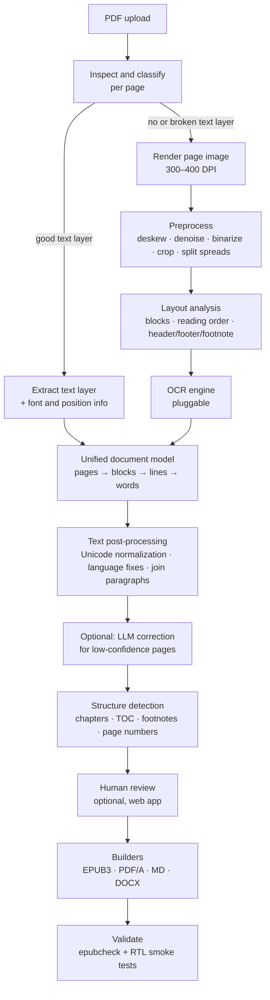

# RTL PDF → E-book Converter: Design Plan

**Status:** Draft v0.2 (POC done, see §11) · **Date:** 2026-09-24

## 1. Goal

Take a PDF of a book written in a right-to-left (RTL) language and produce a clean, reflowable e-book that reads correctly on common e-readers.

Input PDFs fall into three groups:

| Kind | What it looks like | Main difficulty |
|---|---|---|
| **Born-digital** | Typeset PDF with a text layer | The text layer is often *broken* for RTL: glyphs stored in visual (reversed) order, Arabic presentation forms, missing `ToUnicode` maps, or custom font encodings. A text layer that looks fine on screen may copy out as garbage. |
| **Scanned print** | Page images, maybe with a poor OCR layer already added | OCR quality, skew, noise, two-page spreads, headers/footers, footnotes |
| **Scanned typewriter** | Monospaced, uneven ink, broken or filled-in letters, sometimes carbon copies | Stock OCR models are trained on typeset fonts. Typewriters for Arabic script often used simplified letter forms and joins. This is the hardest group. |

**Delivery plan:** build a **core engine + CLI** first, then put a **simple web app** on top of the same engine.

### Non-goals (for v1)
- Keeping the exact visual layout (that's what the PDF is for). The output is *reflowable text*.
- Handwriting recognition.
- Complex tables, math, and multi-column magazine layouts. Detect them and fall back to page images.

### Target languages
Persian (fa), Arabic (ar), Urdu (ur), Hebrew (he), and Yiddish (yi). Each language is a config profile (OCR model, normalization rules, digit style, heading keywords, default font), so adding one means adding config, not code.

---

## 2. Output formats

| Format | Role | Notes |
|---|---|---|
| **EPUB 3** | **Primary** | Open standard. Supported by Apple Books, Google Play Books, Kobo, KOReader, Thorium, and Moon+ Reader. Handles RTL through `page-progression-direction="rtl"` plus `dir`/`lang` attributes. Kindle accepts EPUB through Send-to-Kindle, which converts it. |
| **KEPUB** | Optional | Kobo's EPUB variant, with better page and stats handling. Produced from EPUB by `kepubify`. |
| **AZW3 / KFX** | Optional | Only for side-loading onto Kindle via Calibre `ebook-convert`. Send-to-Kindle with EPUB is the preferred route. Arabic-script support on Kindle must be tested per device and firmware. |
| **Searchable PDF (PDF/A)** | Secondary | The original page images with an invisible OCR text layer (OCRmyPDF). Keeps the exact look and makes the text searchable and copyable. Cheap to produce as a side output. |
| **Fixed-layout EPUB** | Fallback | Page images with hidden text, for books where reflow fails (heavy illustrations, poetry laid out in columns). |
| **Markdown / HTML / DOCX / TXT** | Editing and export | For people who want to proofread or edit in a word processor. DOCX via Pandoc. |
| **hOCR / ALTO XML** | Interchange | Standard OCR formats that keep coordinates and confidence scores. Useful for archives and outside correction tools. |

Recommendation: always produce **EPUB 3**. Offer searchable PDF and Markdown as options. Leave Kindle formats to Calibre.

---

## 3. Pipeline overview



Every stage reads and writes to a **per-job working directory** and caches its results per page. Re-running with different settings only redoes the stages that changed, and a crashed job can resume.

---

## 4. Stage details

### 4.1 Inspect and classify (per page)
For each page, decide which route it takes:
- **Text-layer route:** the page has text *and* passes quality checks.
- **OCR route:** there's no text, the text is only a transparent layer over an image, or the quality checks fail.

Text-layer quality checks, the key step for RTL:
1. **Presentation-form ratio:** a high share of characters in U+FB50–U+FDFF / U+FE70–U+FEFF (Arabic) or U+FB1D–U+FB4F (Hebrew) means the text is shaped glyphs, not logical text. These can often be fixed by normalization.
2. **Visual-order detection:** check each word against a word list in both normal and reversed character order. If reversed words match better, the text layer is stored in visual order. Reverse it per line, and treat numbers and Latin runs carefully.
3. **Garbage ratio:** a high share of Private Use Area characters, Latin-1 junk where Arabic or Hebrew is expected, or `U+FFFD`. Usually means a custom font encoding that can't be recovered, so the page goes to OCR.
4. **Dictionary hit rate** after the fixes above. Below a threshold, the page goes to OCR.

The CLI command `inspect` prints this report without converting anything.

### 4.2 Rendering
- Render pages to images at **300 DPI** (400 for small type or typewriter). Use `pypdfium2` (permissive license) or PyMuPDF (AGPL, see §9).
- When the page is a single embedded scan, extract the original image instead of re-rendering it. That avoids resampling.

### 4.3 Image preprocessing
OpenCV and scikit-image, with some steps optionally done by `unpaper`:
- Deskew (Hough transform or projection profile) and correct orientation (Tesseract OSD).
- Denoise, remove background, and apply contrast normalization (CLAHE).
- Binarize with an adaptive method (Sauvola) rather than a global threshold. Critical for typewriter text and uneven ink.
- Remove borders and punch holes, and crop to content.
- Detect and split **two-page spreads**. The right-hand page comes first in RTL books.
- Typewriter tuning: light morphological closing to fill broken strokes, and a dilate/erode option for over-inked or faded pages.

Every setting can be changed through a profile (`--profile typewriter`, `--profile clean-print`).

### 4.4 Layout analysis and reading order
- Find text blocks, headers, footers, page numbers, footnotes, images, and tables.
- **Reading order in RTL:** columns run right to left, and blocks within a column run top to bottom.
- Remove running headers and footers by matching repeated text or positions across pages.
- Record page numbers (convert Persian and Arabic-Indic digits) so a page list can be built later.
- Tools: Surya layout, the built-in layout in Tesseract/Kraken, or simple heuristics (projection profiles, whitespace analysis) for plain single-column books. Start with heuristics plus the OCR engine's own layout, and add a learned model only if it's needed.

### 4.5 OCR engines (pluggable)
Everything sits behind a single interface:

```python
class OcrEngine(Protocol):
    name: str
    def supports(self, lang: str) -> bool: ...
    def recognize(self, image: Image, lang: list[str], hints: LayoutHints) -> PageResult: ...
    # PageResult = blocks → lines → words, each with bbox, text, confidence
```

Candidate engines:

| Engine | Pros | Cons |
|---|---|---|
| **Tesseract 5** (`tessdata_best`: fas, ara, urd, heb, yid) | Free, offline, mature, fine-tunable, used by OCRmyPDF | Middling on degraded scans and typewriter text. Often mishandles ZWNJ in Persian. |
| **Kraken** (eScriptorium ecosystem) | Built with Arabic script and RTL in mind. Very trainable, which suits typewriter fonts. Handles baselines well. | Needs trained models. Steeper learning curve. |
| **Surya OCR** | Modern, multilingual, includes layout and reading order | Needs a GPU for speed. Check its license for commercial use. |
| **PaddleOCR** | Arabic models, fast | Weaker Persian and Hebrew coverage |
| **Cloud: Google Document AI / Cloud Vision, Azure Document Intelligence** | Usually the strongest on hard scans | Costs money, sends book content to a third party, needs internet |
| **Vision LLM (e.g. Claude)** | Handles strange fonts and typewriter text well, understands context | Can "hallucinate" plausible text, costs per page. Best as a **second opinion or corrector**, not the only source. |

**Plan:** default to **Tesseract**, benchmark Kraken and Surya during Phase 0, and allow a cloud or LLM engine as an opt-in.

**Choosing engines by data:** create a small **ground-truth set** of roughly 30–50 pages covering each input kind and language, transcribed by hand. Measure **character error rate (CER)** and **word error rate (WER)** for every engine and preprocessing profile. Choose defaults from these numbers, and rerun the benchmark in CI whenever the pipeline changes.

**Typewriter strategy:**
1. Try the best stock engine with the typewriter preprocessing profile.
2. If CER is too high, **fine-tune** Tesseract or Kraken on a few hundred corrected lines from that typewriter. The review UI (§6) doubles as a ground-truth collector for this.
3. Optionally, a vision LLM transcribes low-confidence lines, checked against the OCR output.

### 4.6 Unified document model
Every route (text layer or any OCR engine) produces the same model, stored as JSON:

```
Document
 ├─ metadata: title, author, language, direction, source file hash
 └─ pages[]
     ├─ number (physical), label (printed page number, if found)
     ├─ image_ref, route (text-layer | ocr:<engine>)
     └─ blocks[]  type: heading|paragraph|footnote|header|footer|pagenum|image|table|poetry
         └─ lines[] → words[]  {text, bbox, confidence, dir}
```

Exporting this model to hOCR or ALTO is a cheap addition.

### 4.7 Text post-processing
Split into shared rules plus per-language rules:

- **Unicode:** NFC, plus *targeted* mapping of presentation forms to base letters. Avoid blanket NFKC, which also changes other characters.
- **Persian:** Arabic `ي`/`ك` → Persian `ی`/`ک`. Fix **ZWNJ (U+200C, the "half space")** in prefixes and suffixes such as `می‌`, `ها`, `ای`, `تر`. Remove tatweel (`ـ`). Choose a consistent digit style (Persian `۰–۹` vs Arabic-Indic `٠–٩` vs Latin). The `hazm` and `parsivar` libraries can help here; check their licenses.
- **Arabic:** optionally keep or strip harakat (diacritics). Normalize alef and hamza variants only when the user asks for it.
- **Hebrew/Yiddish:** keep niqqud. Handle final letter forms and geresh/gershayim.
- **Paragraph rebuilding:** join lines into paragraphs using indentation, line-end position, and punctuation. Join paragraphs that continue across a page break. Remove hyphenation, which is rare in RTL scripts but appears in Latin text inside the book.
- **Mixed direction (bidi):** store text in *logical order* and let the reader apply the Unicode Bidi Algorithm. Wrap embedded Latin or number runs in `<span dir="ltr">`/`<bdi>` only where needed. Don't sprinkle RLM/LRM marks throughout the text.
- **Dictionary spell-check** marks suspicious words for review. It doesn't change them automatically.

### 4.8 Optional LLM correction
- Runs only on lines or pages whose confidence is below a threshold, or when the user asks for it.
- Sends the page image and the OCR text, and asks for a **minimal-edit** correction. Output is compared back to the original. Changes beyond a set edit distance are rejected or flagged, which guards against hallucination.
- Off by default, since it sends book content to an API. Needs an explicit flag and an API key. The model is configurable; the default is a current Claude model.

### 4.9 Structure detection
- **Chapters and headings:**
  - Born-digital: font size and weight.
  - OCR: line height, centering, short lines, extra whitespace, and keyword lists (`فصل`, `بخش`, `باب`, `گفتار`, `פרק`, …).
  - The book's own printed table of contents, if found, can be matched against detected headings.
- **Footnotes:** detect by position, small type, and marker numbers. Link each marker to its note (EPUB 3 `epub:type="noteref"` → `<aside epub:type="footnote">`).
- **Front matter:** title page, copyright page, dedication. Use the first page image as the cover unless the user supplies one.
- **Page list:** keep the printed page numbers as an EPUB 3 `page-list`, so readers can cite the print edition.
- **Poetry:** detect two-column verse (hemistichs, common in Persian and Arabic books) and render it with a dedicated CSS layout instead of merging it into prose.

### 4.10 EPUB 3 builder
Write the EPUB directly (it's a ZIP with XHTML, CSS, and an OPF manifest) using Jinja2 templates. This keeps full control over the RTL details and avoids AGPL dependencies. Pandoc is another option for other formats.

Required for RTL:
- `package.opf`: `<spine page-progression-direction="rtl">`, `<dc:language>fa</dc:language>`, and `xml:lang`.
- Every XHTML file: `<html lang="fa" xml:lang="fa" dir="rtl">`.
- CSS: `direction: rtl; unicode-bidi: embed; text-align: justify;` (or `start`). Use logical properties (`margin-inline-start`). Avoid `text-align: right/left`.
- **Embedded fonts** under the OFL license: e.g. **Vazirmatn** (Persian), **Noto Naskh Arabic**, **Noto Nastaliq Urdu**, **Noto Sans/Serif Hebrew**. Embedded fonts matter because many e-readers lack good Arabic-script fonts. Readers can still override them.
- Navigation: `nav.xhtml` with a TOC and page list, plus `toc.ncx` for older EPUB 2 readers.
- One XHTML file per chapter, to keep things fast on low-power e-readers.
- Accessibility metadata (`schema:accessMode`, etc.).

### 4.11 Validation
- Run **epubcheck** (Java) and treat any error as a build failure.
- RTL smoke tests: page direction attribute present, `dir`/`lang` set on every document, no leftover presentation forms, no visual-order text, fonts embedded and referenced.
- Optional: render the EPUB headlessly (Thorium CLI or a Chromium-based renderer) and take screenshots of sample pages for visual regression tests.

---

## 5. CLI design (Phase 1)

Python package `rtlbook` (working name). The CLI is built with **Typer**.

```bash
# See what's inside before converting
rtlbook inspect book.pdf
#  → pages: 312 | text-layer OK: 0 | broken text layer: 12 | image-only: 300
#  → detected language: fa (0.97) | suggested profile: scanned-print

# One-shot conversion
rtlbook convert book.pdf -o book.epub \
    --lang fa --profile typewriter --engine tesseract \
    --formats epub,pdfa,md --cover cover.jpg \
    --title "…" --author "…"

# Step by step (resumable, each stage cached in ./book.rtlbook/)
rtlbook ocr     book.pdf --pages 1-20 --engine kraken
rtlbook review  book.rtlbook/           # opens a local review UI (later phase)
rtlbook build   book.rtlbook/ --formats epub

# Benchmark engines against ground truth
rtlbook bench   groundtruth/ --engines tesseract,kraken,surya
```

Other behavior:
- Config: a `rtlbook.toml` file per project, overridable with flags. Language profiles live in `profiles/*.toml`.
- Parallel processing per page (`--jobs N`, using a process pool).
- Progress bar and a structured log. The JSON log is reused by the web app for progress reporting.
- Exit codes reflect validation results, so the CLI works in scripts.

---

## 6. Web app (Phase 2+)

The same engine in a thin shell. The web layer contains no conversion logic.

```mermaid
flowchart LR
    U[Browser] -->|upload| API[FastAPI]
    API --> S[(Storage<br/>local disk → S3-compatible)]
    API -->|enqueue| Q[(Redis queue)]
    Q --> W[Worker(s)<br/>rtlbook engine]
    W --> S
    W -->|progress events| API
    API -->|SSE| U
```

- **Backend:** FastAPI. Uploads stream to disk, with a size limit (e.g. 500 MB).
- **Job queue:** start with **RQ or arq + Redis**, or even FastAPI background tasks for single-user use. Workers run the pipeline.
- **Frontend:** server-rendered HTML with **HTMX** plus a little JavaScript. No SPA is needed at first.
- **Pages:**
  1. *Upload:* drop the PDF, choose language and profile (or auto-detect), set metadata and cover.
  2. *Job status:* live per-page progress over Server-Sent Events, and the inspection report.
  3. *Review (key feature):* page image beside the extracted text. Low-confidence words are highlighted. Users can edit inline, adjust chapter breaks and the TOC, and accept or reject LLM corrections. Every edit is saved as ground truth for fine-tuning (§4.5).
  4. *Download:* EPUB and the other formats, the validation report, and a preview in the browser (epub.js or Readium, set up for RTL).
- **Privacy and retention:** files are deleted automatically after N days. Cloud and LLM engines are opt-in per job, with a clear notice. Anyone other than a single local user needs authentication.
- **Deployment:** one **Docker image** containing Tesseract with `tessdata_best`, fonts, a Java runtime for epubcheck, and optionally Calibre and kepubify. Use `docker compose` for app, worker, and Redis. Add a GPU worker variant if Surya or Kraken prove worth using.

---

## 7. Proposed repository layout

```
rtlbook/
├─ DESIGN.md
├─ pyproject.toml            # uv-managed; Python 3.12+
├─ src/rtlbook/
│  ├─ cli.py                 # Typer entry point
│  ├─ pipeline.py            # stage orchestration, caching, resume
│  ├─ model.py               # document model (pydantic)
│  ├─ inspect/               # page classification, text-layer checks
│  ├─ render/                # PDF → images
│  ├─ preprocess/            # deskew, binarize, split spreads, profiles
│  ├─ layout/                # blocks, reading order, header/footer removal
│  ├─ ocr/                   # engine interface + tesseract/kraken/surya/cloud/llm
│  ├─ text/                  # normalization, per-language rules, paragraphs
│  ├─ structure/             # chapters, TOC, footnotes, page list, poetry
│  ├─ build/                 # epub3, pdfa, markdown, docx builders + templates
│  └─ validate/              # epubcheck wrapper, RTL checks
├─ profiles/                 # fa.toml, ar.toml, he.toml, typewriter.toml, …
├─ assets/fonts/             # OFL fonts + license files
├─ web/                      # FastAPI app, templates, static (Phase 2)
├─ groundtruth/              # benchmark pages + transcriptions
├─ input/                    # PDFs to convert (git-ignored)
├─ output/                   # EPUB/KFX + per-book OCR caches (git-ignored)
├─ tests/
└─ docker/
```

---

## 8. Milestones

| Phase | Scope | Done when |
|---|---|---|
| **0: Spike and benchmark** (≈1 week) | Collect 30–50 sample pages (born-digital, scanned, typewriter). Transcribe ground truth. Run Tesseract/Kraken/Surya with 2–3 preprocessing variants. Build a hand-made EPUB and test it on the target readers. | CER table per engine and input kind. Engine defaults chosen. RTL EPUB template confirmed on Apple Books, Kobo/KOReader, Google Play Books, and Kindle via Send-to-Kindle. |
| **1: CLI MVP** | `inspect`, `convert`. Text-layer route with RTL fixes. Tesseract OCR route. Basic preprocessing. Paragraph rebuilding. Simple chapter detection. EPUB 3 builder with epubcheck. | A scanned Persian book and a born-digital one each become a valid EPUB that reads correctly on 3+ readers. |
| **2: Quality** | Layout analysis, header/footer removal, footnotes, page list, poetry. Typewriter profile. Per-language normalization. Searchable PDF and Markdown outputs. `bench` command in CI. | CER on typewriter pages below the target set in Phase 0. No regressions in CI. |
| **3: Web app MVP** | Upload → job → download. Queue and worker. SSE progress. Docker compose. | A non-technical user converts a book from the browser. |
| **4: Review and correction** | Side-by-side review UI, TOC editor, ground-truth capture, optional LLM correction, optional cloud engines. | A user can fix a book to publishable quality without leaving the app. |
| **5: Fine-tuning loop** | Train Tesseract/Kraken models from reviewed pages, and choose a model per book or typewriter. | Measurable CER drop on the typewriter set. |

---

## 9. Risks and decisions to make

- **Licenses:** PyMuPDF and `ebooklib` are **AGPL**. That's fine for personal use, but a public web service would have to release its source. Prefer `pypdfium2` and a custom EPUB writer. Check Surya/Kraken model licenses and the `hazm` license before relying on them.
- **Typewriter accuracy** may stay poor without fine-tuning. Plan for human review on those books.
- **Hallucination with LLM or VLM OCR:** limit edits by comparing against the OCR output, and always show a diff in review.
- **Kindle RTL support** varies. Treat Kindle as best effort, and point users to EPUB readers with good RTL support.
- **Privacy and copyright:** books may be copyrighted or private. Local-first by default. Cloud and LLM use must be explicit.
- **Performance:** CPU Tesseract at 300 DPI takes roughly a few seconds per page. A 400-page book is minutes to tens of minutes. Handle this with per-page parallelism, caching, and optional GPU engines. Measure it in Phase 0.

### Open questions
1. Which languages come first? Persian only, or Arabic, Urdu, and Hebrew from the start?
2. Which e-readers must work? This decides whether Kindle output is a real requirement.
3. Is this a personal/local tool or a public multi-user service? Affects auth, licensing, and hosting.
4. Is sending pages to cloud OCR or an LLM ever acceptable, or must everything stay offline?
5. Is a GPU available for the heavier engines?
6. How many typewriter books are there, and from how many different typewriters? Decides whether fine-tuning is worth it.

---

## 10. Key tools and references
- OCR: Tesseract 5 + `tessdata_best`, OCRmyPDF, Kraken / eScriptorium, Surya, PaddleOCR
- PDF: pypdfium2, PyMuPDF, pdfplumber
- Images: OpenCV, scikit-image, unpaper
- Text: Python `unicodedata`, `regex` (Unicode script properties), hazm/parsivar (Persian), `python-bidi` (debugging only)
- E-book: EPUB 3.3 spec (W3C), epubcheck, Calibre `ebook-convert`, kepubify, Pandoc, epub.js / Readium for preview
- Fonts: Vazirmatn, Noto Naskh Arabic, Noto Nastaliq Urdu, Noto Serif/Sans Hebrew (all OFL)
- Standards: hOCR, ALTO XML, PAGE XML (OCR interchange), EPUB Accessibility 1.1

---

## 11. Decisions and POC results (2026-09-24)

**Decisions**
- **Runtime: Docker.** One image (`docker/Dockerfile`) with Tesseract 5 and `tessdata_best` (fas, ara), epubcheck 5.1, Java, the Vazirmatn font, and Python deps via uv. The `./rtlbook` wrapper runs the CLI with the current directory mounted.
- **First language: Persian.**
- **Kindle output: KFX, built locally.** Tested on the device: AZW3 (Calibre) renders Persian with heavy lag and multiple refreshes. KFX is much faster and has Persian reflow and real page numbers. The pipeline: EPUB (container) → **Kindle Previewer 4 on the Mac** (EPUB→KPF, macOS/Windows only) → calibre **KFX Output** plugin in the container (KPF→KFX). Run it with `./rtlbook kfx book.epub`. Nothing is uploaded to Amazon.
- **Digits:** Persian ۰–۹ by default for Persian books (`--digits`).
- **PDF library: pypdfium2.** **EPUB writer: our own** (§4.10). No AGPL dependencies.

**POC book:** *Parichehr* (پریچهر), 472 pages, exported from Word 2007.
- The text layer is **completely garbled** (a broken glyph→Unicode map). `inspect` detects this on every page (function-word score 0.009) and sends the pages to OCR. This confirmed §4.1: a born-digital PDF can't be trusted as-is.
- **OCR:** Tesseract `fas` at 300 DPI, **binarized first**, which was essential because the tinted page background broke some lines. The full book took **~2 minutes** on an M2 (8 workers), with 86.8% mean confidence. 400 DPI didn't help.
- **Font-specific OCR quirks:** the Persian comma is read as `»`/`ء`, and closing parentheses come out mirrored. Both are fixed in post-processing, gated on book-level detection so books that OCR correctly aren't changed.
- **Paragraph rebuilding:** uses dialogue markers (`Name- …`), sentence-final punctuation, full-width lines (the RTL line end reaches the left margin), and large vertical gaps. Paragraphs join across page breaks.
- **Output:** a valid EPUB 3.3 (epubcheck: 0 errors, 0 warnings) with RTL page progression, the embedded font, a cover, and a print page list.
- Detailed log and all intermediate outputs: `output/poc/NOTES.md` (git-ignored because it contains book text).

**Batch of 8 novels (3,231 pages).** All 8 converted to valid EPUB and KFX, about 13 minutes of OCR in total.
- **Not one had a usable text layer.** 3 had garbled glyph mappings. 5 stored words in **reversed (visual) order**: sentence punctuation started 28–52% of lines and ended ≤4%. One also split words at glyph boundaries. The per-page function-word score misses reversed order, so the checks now also run at the **book level** (punctuation position, share of one-letter words).
- Mean OCR confidence was 81.6–86.8 per book. The output passes the order checks (≤0.4% of paragraphs start with sentence punctuation).
- Added **fuzzy chapter headings** (edit distance on `فصل` + ordinals), and **running header/watermark removal** (lines repeated in the top/bottom 15% of ≥20% of pages, removed from 484–558 pages in 3 books).
- Remaining quirk: a bold font where `!` without a following space OCRs as `ا` (Shirin). Fixable with corpus word statistics.

**Next steps**
1. ✅ Kindle tested on the device: KFX is good. Still to test: Apple Books, Kobo/KOReader.
2. Hand-correct 3–5 pages as ground truth, and add a `bench` command that measures CER (§4.5).
3. Try **repairing the broken text layer** (§4.1): learn the glyph→letter substitution by aligning OCR output with the garbled text on a few pages, then decode the whole book with no OCR errors.
4. Get a real scanned book and a typewriter book to exercise preprocessing (§4.3).
5. Header/footer detection, and optional ZWNJ normalization (`می گویم` → `می‌گویم`).
