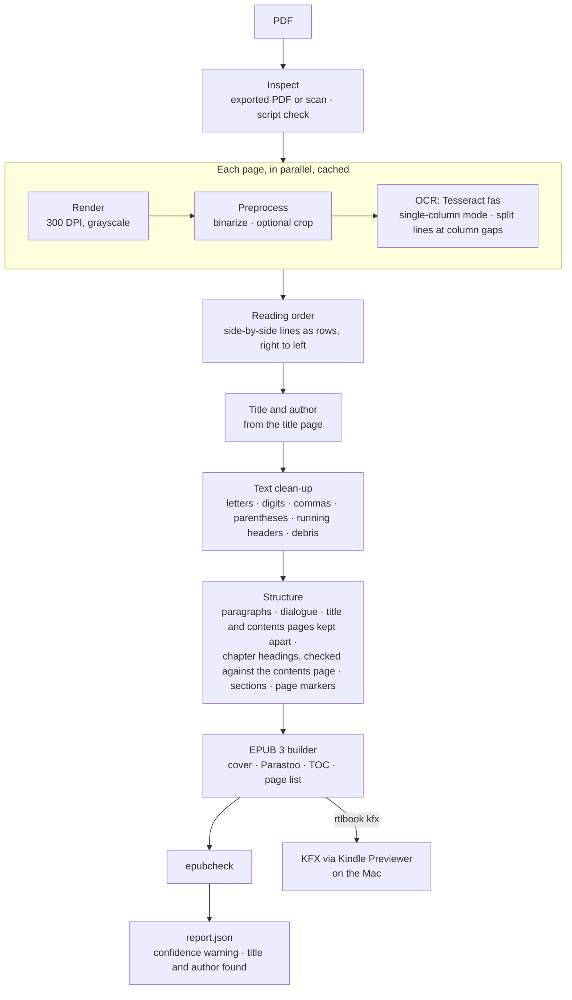

# RTL PDF → E-book Converter: Design

**Status:** proof of concept. Exported Persian PDFs convert end to end to EPUB 3 and Kindle KFX; scans convert
with more errors and aren't supported yet. · **Version:** v0.4 · **Date:** 2026-10-07

> Each section says what is **built** and what was **dropped**; what's planned is in [ROADMAP.md](ROADMAP.md).
> The dated decisions and measurements behind it are in §11 (POC, 2026-09-24) and §12 (2026-10-01 – 10-02).

## 1. Goal

Take a PDF of a book written in a right-to-left (RTL) language and produce a clean, reflowable e-book that reads
correctly on common e-readers. Persian first; Arabic, Urdu and Hebrew later, as configuration where possible.

Support grows **one document type at a time**. Each type is finished, with measured accuracy, before the next:

| Type | What it is | Status |
|---|---|---|
| **Exported PDF** | Made by a word processor or layout tool: the PDF draws the text | **Supported** (phase 1) |
| **Scan of modern print** | Page images of a 1970s+ book | Converts; to be measured and supported (phase 3) |
| **Scan of old letterpress** | Page images of a 1900–1960s book | Converts with many errors; needs another engine (phase 4) |
| **Typewritten** | Uneven ink, broken letters | Later |
| Handwriting, lithographs (چاپ سنگی) | Calligraphy, not type | Out of scope |

The phases are in [ROADMAP.md](ROADMAP.md).

Content types follow the same idea: prose first, then verse (couplets), mixed prose and verse, heavy footnotes.

**Why OCR even for exported PDFs:** their stored text looks right on screen but rarely copies out right in
Persian: wrong character codes, words in reversed (visual) order, missing spaces, each PDF tool scrambling
differently. rtlbook therefore OCRs every page (§4.1, §12).

### Non-goals (for now)
- Keeping the exact visual layout (that's what the PDF is for). The output is reflowable text.
- Handwriting recognition.
- Complex tables, math, and multi-column magazine layouts.

---

## 2. Output formats

| Format | Status | Notes |
|---|---|---|
| **EPUB 3** | **Built** | `page-progression-direction="rtl"`, `dir`/`lang` on every document, embedded Parastoo font, cover, chapter TOC and print page list. Opens in Apple Books, Kobo, KOReader, PocketBook, Boox. |
| **KFX (Kindle)** | **Built** | Kindle Previewer (on the Mac) makes a KPF, calibre's KFX Output plugin (in the container) packages it. All local; nothing is uploaded to Amazon. Fast, with Persian reflow and real page numbers. |
| AZW3 | Dropped | Tested on a Kindle: renders Persian with heavy lag (§11). |

---

## 3. Pipeline



Each page's OCR result is cached in the book's work folder (`output/<name>.rtlbook/pages/`), keyed by the OCR
settings. Re-running with other text or EPUB options takes seconds. Pages are OCR'd in parallel.

---

## 4. Stage details

### 4.1 Inspect: document type — built
`inspect` reports whether a PDF is an **exported PDF** (supported) or a **scan** (page images; converts, not
supported yet), with the scan resolution. A page counts as a scan if images cover most of it, or a good part of it
while the text layer holds almost no Persian letters (scanned strips pasted into Word, or a scan with an English
header). `convert` prints the same verdict and warns on scans. Correct on all 10 test PDFs.

**Script check — built.** Before OCR, Tesseract's orientation and script detection (OSD, `--psm 0`, the `osd`
model) looks at up to six pages picked at random from the body of the book (not the first or last tenth; the same
book always gets the same pages) until three answer, and takes the majority (`script.py`). If the book is in another
script than the OCR language's (Latin for `fas`), `convert` says so, in the `start` event too (`script`,
`script_expected`), and goes on; a program running it can stop it there. OSD reads the page images, so it works on
scans and garbled text layers alike, in about 0.5 s a page. It names scripts, not languages: Persian, Arabic and
Urdu are all Arabic. Its confidence number varies too much to use (2 to 260 on clean pages), so only the names
count. Correct on all 18 Persian test PDFs (7 of them scans) and on test pages in 11 scripts (Latin, Cyrillic,
Arabic in three styles including Nastaliq, Hebrew, Han, Devanagari, Thai; sideways and upside-down pages too).

*Dropped:* a text-layer route that read the PDF's own text when quality checks passed (presentation forms,
visual-order detection, garbage ratio, common-word score). None of 11 exported Persian PDFs had a text layer
usable as is; rebuilding it needed rules per PDF tool, while OCR misread about 0.5% of letters (§12).

### 4.2 Rendering — built
- Pages render at **300 DPI** with `pypdfium2` (permissive license). 400 DPI was slower with no gain (§11).
- *Dropped (2026-10-06), to keep the input simple:* a folder of page images instead of a PDF (PNG, JPEG, TIFF,
  JP2, e.g. an unpacked Internet Archive JP2 ZIP). Scans still convert when they come as a PDF. Worth bringing back
  for scans ([ROADMAP.md](ROADMAP.md)).

### 4.3 Image preprocessing — built
Grayscale and **Otsu binarization** (essential for tinted page backgrounds), optional edge crop for framed pages.

### 4.4 Layout and reading order — built for single-column pages and two-column verse
- Tesseract runs in **single-column mode (`--psm 4`)**. Its automatic layout (`--psm 3`) silently dropped lines set
  in larger type.
- In that mode two-column verse comes back as one line. Lines are **split at wide word gaps that line up across
  the page** (wide spaces in prose fall at random places, so prose is left alone).
- Lines that sit **side by side are read as one row**, rows top to bottom, each row right to left, so a couplet's
  two half-lines stay together.
- **Running headers, footers and watermarks** repeated in the top/bottom 15% of many pages are removed, including
  OCR variants of them (a misread letter, or only part of the header).

### 4.5 OCR engines and accuracy
- **Built:** Tesseract 5 with `tessdata_best` (`fas`). About 1–2 s per page per core.
- **Measured** with `rtlbook eval` (character and word error rates against a checked text; spelling conventions
  such as ي/ی, digits, half-spaces and vowel marks count as equal):

| Material | Tesseract | Kraken (OpenITI Persian) | AI vision |
|---|---|---|---|
| Exported PDF (a 1946 story) | **0.8%** letters wrong (~0.5% real misreads) | — | — |
| 1932 letterpress | 6–8% | **1.9%** | — |
| 1960s poetry print | **6–12%** | 20–30% | — |
| Two-column verse, narrow gutter | ~46% of words found | ~77% | **~89%**, layout handled |

Kraken and AI vision were only measured in experiments; Tesseract is the only engine in the pipeline.

### 4.6 Document model — built
```
Page:      number, width, height, settings (OCR cache key), lines[]
Line:      text, bbox (pixels on the rendered page), confidence
Paragraph: segments (text, plus markers where a printed page starts), heading flag
Section:   title, paragraphs[]  → one XHTML file in the EPUB
```

### 4.7 Text clean-up — built
- A warning when a book's mean OCR confidence is below 70 (exported PDFs score 80–87; a decorative
  font scored ~55), in `report.json` and the `done` event.
- Arabic `ي`/`ك` → Persian `ی`/`ک`; tatweel removed; Persian digits by default (`--digits`); the Persian
  comma misread as `»` (a `»` with no open `«` in its paragraph) or as a word-final `ء`; mirrored parentheses;
  OCR debris lines; dropping lines by regex (`--drop-lines`) or below a confidence (`--min-line-conf`).
- **Paragraphs:** rebuilt from line position (does the line reach the left margin?), sentence-final punctuation,
  dialogue markers (`Name- …`) and vertical gaps, and joined across page breaks.
- Text is stored in logical order; the reader's bidi algorithm handles display. No RLM/LRM sprinkling.

### 4.8 Structure — built
- Chapter headings of three kinds: `فصل` + ordinal, tolerant of OCR errors (edit distance); a short
  line in **large type** (≥ 1.6× the book's line height, with big letters rather than two merged lines, and OCR
  confidence ≥ 60); a short **numbered title** with space above it (`۲ـ غلام`; a lone `۱` misread as `ا` is
  fixed). A wrapped large-type title stays one heading. Books without headings are split into ~20-page sections; cover from the first page image; EPUB page list from the PDF pages.
- Title, credits and contents pages (far fewer words than a typical page) keep each line separate
  and don't run into the text.
- Title and author from the title page: a `نام کتاب :` / `نویسنده :` label, else the line right above
  the author line, else the topmost large-type line (a pen name such as `م. مودب‌پور` is the author, not the title);
  credit lines (typist, converter, website, publisher) are skipped and PDF metadata is ignored (usually wrong). `convert`
  reports what it found and where from.
- The book's contents page (a sparse page with 4+ numbered lines) corrects chapter headings OCR'd
  worse than their entry, and turns a short standalone line matching an entry into a heading.

### 4.9 EPUB 3 builder — built
Written directly (a ZIP of XHTML, CSS and an OPF manifest), keeping full control of RTL details and avoiding
AGPL dependencies. One XHTML file per section, `nav.xhtml` with TOC and page list plus `toc.ncx`, the
Parastoo font (OFL, a book typeface) embedded by default (`--no-embed-font` to leave it to the reader).

### 4.10 Validation — built
- **epubcheck** on every build; any error fails `convert`.
- **Accuracy:** `rtlbook eval` against checked text, and `tests/test_ground_truth.py`, which fails if accuracy on
  the public-domain pages in `tests/data/` drops below the baseline.

---

## 5. CLI

Runs in Docker through the `./rtlbook` wrapper, which only shares the repository folder with the container.

```bash
./rtlbook inspect input/book.pdf                       # exported PDF or scan? right script?
./rtlbook convert input/book.pdf --title "…" --author "…"   # → output/book.epub
./rtlbook kfx output/book.epub                         # → output/book.kfx (macOS + Kindle Previewer)
./rtlbook eval output/book.rtlbook ref.txt --pages 24  # accuracy against a checked text
```

Main `convert` options: `--pages`, `-j/--jobs`, `--drop-lines REGEX`, `--min-line-conf`, `--crop`, `--digits`,
`--cover`, `--psm`, `--dpi`, `-o`, `--work`. Full list in the README.

*Dropped from the original plan:* `bench` (replaced by `eval`), and separate `ocr`/`review`/`build` steps (not
needed while each book is one `convert` with a page cache).

---

## 6. Review page — prototype

A local page for a person to settle what the engine can't: for each uncertain spot, a crop of the scan line, the
candidate readings as buttons, and a box to type the right text. A "save" button writes the decisions to a JSON
file, which a script applies to the text. A prototype was used to check OCR ground truth against scans
(`output/poc/27-eval/`, git-ignored): far quicker and more reliable than correcting OCR text by eye.

---

## 7. Repository layout

```
rtlbook/
├─ rtlbook                   # wrapper: runs the CLI in Docker; `kfx` runs Kindle Previewer on the host
├─ docker/Dockerfile         # Tesseract, epubcheck, calibre + KFX Output plugin, fonts, Python deps
├─ src/rtlbook/
│  ├─ cli.py                 # Typer commands: inspect, convert, kfx, eval
│  ├─ doctype.py             # exported PDF or scan
│  ├─ script.py              # script check: Tesseract OSD on a few random pages
│  ├─ pdf.py                 # PDFs: rendering, page info, cover image
│  ├─ preprocess.py          # binarize, crop
│  ├─ ocr.py                 # Tesseract, line boxes, column-gap splitting
│  ├─ pipeline.py            # parallel OCR with a per-page cache; sections
│  ├─ layout.py              # reading order (rows, right to left)
│  ├─ text.py                # normalization, OCR fixes, headers/footers, paragraphs
│  ├─ headings.py            # chapter headings
│  ├─ model.py               # Page, Line, Paragraph, Section
│  ├─ epub.py                # EPUB 3 writer
│  ├─ kindle.py              # KPF → KFX
│  ├─ evaluate.py            # accuracy against a checked text
│  └─ validate.py            # epubcheck
├─ tests/                    # unit tests; tests/data/ = public-domain ground truth
├─ docs/                     # DESIGN.md (this file), ROADMAP.md (phases, planned work), LESSONS.md (troubleshooting)
├─ input/                    # PDFs to convert (git-ignored)
└─ output/                   # EPUB/KFX, per-book OCR caches, experiment notes (git-ignored)
```

---

## 8. Phases

Moved to [ROADMAP.md](ROADMAP.md).

---

## 9. Risks and decisions

- **Licenses:** no AGPL dependencies (PyMuPDF and `ebooklib` avoided). Kraken's OpenITI models are CC0.
- **Privacy and copyright:** books may be copyrighted or private. Everything runs locally; the container only sees
  the repository folder. Outside services (AI vision) only ever opt-in. Book text is never committed, except
  public-domain test pages.
- **AI vision** can produce fluent but wrong text. Use it with an independent engine and review disagreements.
- **Kindle:** KFX needs Kindle Previewer, which only runs on macOS/Windows.

### Answered since v0.2
1. Languages: **Persian first.**
2. E-readers: **EPUB readers and Kindle (KFX).**
3. **A local tool.**
4. Cloud OCR / AI: **opt-in only**; not used yet.
5. GPU: **none** (Apple Silicon CPU). Tesseract and Kraken both run on CPU.
6. Typewriter books: **none found yet.**

---

## 10. Key tools and references
- OCR: Tesseract 5 + `tessdata_best` (`fas`, `ara`; `osd` for the script check); Kraken with OpenITI's printed Persian/Arabic-script models (Zenodo)
- PDF and images: pypdfium2, Pillow
- E-book: EPUB 3.3 (W3C), epubcheck, Kindle Previewer 4, calibre + KFX Output plugin
- Font: Parastoo (OFL); Vazirmatn until 2026-10-05

---

## 11. Decisions and POC results (2026-09-24)

**Decisions**
- **Runtime: Docker.** One image (`docker/Dockerfile`) with Tesseract 5 and `tessdata_best` (fas, ara, and osd for the script check), epubcheck 5.1, Java, the Parastoo font, and Python deps via uv. The `./rtlbook` wrapper runs the CLI with the current directory mounted.
- **First language: Persian.**
- **Kindle output: KFX, built locally.** Tested on the device: AZW3 (Calibre) renders Persian with heavy lag and multiple refreshes. KFX is much faster and has Persian reflow and real page numbers. The pipeline: EPUB (container) → **Kindle Previewer 4 on the Mac** (EPUB→KPF, macOS/Windows only) → calibre **KFX Output** plugin in the container (KPF→KFX). Run it with `./rtlbook kfx book.epub`. Nothing is uploaded to Amazon.
- **Digits:** Persian ۰–۹ by default for Persian books (`--digits`).
- **PDF library: pypdfium2.** **EPUB writer: our own** (§4.9). No AGPL dependencies.

**POC book:** *Parichehr* (پریچهر), 472 pages, exported from Word 2007.
- The text layer is **completely garbled** (a broken glyph→Unicode map). `inspect` detected this on every page (function-word score 0.009) and sent the pages to OCR. This confirmed §4.1: a born-digital PDF can't be trusted as-is. (That text-layer check was later removed: every page is OCR'd, §12.)
- **OCR:** Tesseract `fas` at 300 DPI, **binarized first**, which was essential because the tinted page background broke some lines. The full book took **~2 minutes** on an M2 (8 workers), with 86.8% mean confidence. 400 DPI didn't help.
- **Font-specific OCR quirks:** the Persian comma is read as `»`/`ء`, and closing parentheses come out mirrored. Both are fixed in post-processing, gated on book-level detection so books that OCR correctly aren't changed.
- **Paragraph rebuilding:** uses dialogue markers (`Name- …`), sentence-final punctuation, full-width lines (the RTL line end reaches the left margin), and large vertical gaps. Paragraphs join across page breaks.
- **Output:** a valid EPUB 3.3 (epubcheck: 0 errors, 0 warnings) with RTL page progression, the embedded font, a cover, and a print page list.
- Detailed log and all intermediate outputs: `output/poc/NOTES.md` (git-ignored because it contains book text).

**Batch of 8 novels (3,231 pages).** All 8 converted to valid EPUB and KFX, about 13 minutes of OCR in total.
- **Not one had a usable text layer.** 3 had garbled glyph mappings. 5 stored words in **reversed (visual) order**: sentence punctuation started 28–52% of lines and ended ≤4%. One also split words at glyph boundaries. The per-page function-word score missed reversed order, so the checks were extended to the **book level** (punctuation position, share of one-letter words), before the text-layer route was dropped altogether (§12).
- Mean OCR confidence was 81.6–86.8 per book. The output passes the order checks (≤0.4% of paragraphs start with sentence punctuation).
- Added **fuzzy chapter headings** (edit distance on `فصل` + ordinals), and **running header/watermark removal** (lines repeated in the top/bottom 15% of ≥20% of pages, removed from 484–558 pages in 3 books).
- Remaining quirk: a bold font where `!` without a following space OCRs as `ا` (Shirin). Fixable with corpus word statistics.

**Next steps** (open ones have moved to [ROADMAP.md](ROADMAP.md))
1. ✅ Kindle tested on the device: KFX is good (AZW3 too slow).
2. ✅ Running header/footer removal and OCR-tolerant chapter headings.
3. ✅ Ground truth and accuracy measurement: `rtlbook eval` and `tests/data/` (§12).
4. ✅ Scanned books: collected and measured in experiments (§12).
5. ✅ **Title and author** from the title page; title, credits and contents pages kept out of the text (§4.8).
6. ✗ Repairing broken text layers: tried, and dropped in favour of OCR for every page (§12).

Practical lessons and troubleshooting: [LESSONS.md](LESSONS.md).

---

## 12. Decisions and results (2026-10-01 – 10-02)

**Measuring accuracy.** `rtlbook eval` compares OCR output with a correct text of the same pages: character and
word error rates (Persian spelling conventions such as ي/ی, digits, half-spaces and vowel marks count as equal),
plus line-based scores that separate misread letters from reading-order problems. `tests/data/` holds two
hand-checked, public-domain pages (Hedayat, *Three Drops of Blood*, 1932) and a test that fails if accuracy drops.

**OCR every page; no text-layer route.** Three more exported PDFs were tested. Their stored text had the right
letters but words in visual (reversed) order and missing spaces, scrambled differently by each PDF tool.
Rebuilding the text from character positions worked for some tools but needed rules per tool. OCR scored
**0.8% of letters wrong** on an exported story (measured against its own rebuilt text; ~0.5% real misreads,
the rest spacing) in 5.5 s, so the text-layer route (`classify.py`, `--force-ocr`) was removed. One exception
remains open: a decorative font OCRs badly (confidence ~55%) although its stored letters are right.

**OCR settings.** Tesseract `--psm 4` (one column of lines of any size) instead of `--psm 3`: the automatic layout
dropped lines in larger type. In that mode two-column verse comes back as one line, so lines are split where
wide word gaps line up across the page, and side-by-side lines are read row by row, right to left. A `»` with
no open `«` in its paragraph is read as a Persian comma.

**Support grows by document type.** Phase 1 is exported PDFs (prose). Scans come later. Experiments on scans,
for later phases: on 1932 letterpress, Kraken with OpenITI's Persian model misread 1.9% of letters against
6–8% for Tesseract, but did worse on 1960s type; an AI vision model read a hard two-column verse page best
and also handled its layout. Notes: `output/poc/26`–`31` (git-ignored).

**Removed:** AZW3 output (KFX replaced it), the Ganjoor download command (only needed for verse, later).

